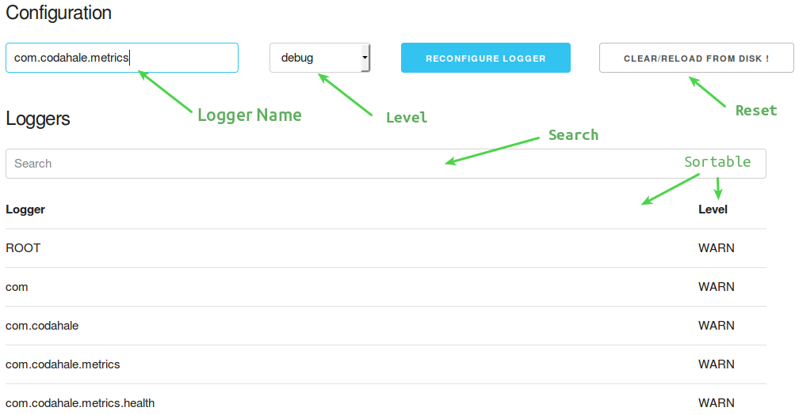

# logback-servlet

Servlet for Logback to configure log levels at runtime.

The loggers are also searchable and sortable.

## Usage

Put the file [LogbackServlet.java](https://raw.githubusercontent.com/tomsquest/logback-servlet/master/src/main/java/ch/qos/logback/servlet/LogbackServlet.java) in your project and declare it as a Servlet.

For example:

``` java
Dynamic logback = servletContext.addServlet("logback", new LogbackServlet());
logback.addMapping("/logback/*");
logback.setLoadOnStartup(1);
```

## Screenshot

